# DataOps - Laboratório 6

Processmento e Análise de Dados em AWS GLue

As instruções do laboratório estão em português. Para alterar o idioma, procure a opção na barra inferior do console AWS.


## Objetivos

* Utilizar AWS Glue Crawler para encontrar dados no S3
* Armazenar dados encontrados pelo Crawler no AWS Glue Data Catalog
* Executar um processo de ETL no AWS Glue para extrair do Data Catalog, fazer transformações, e incluir no Redshift


## Arquitetura da solução

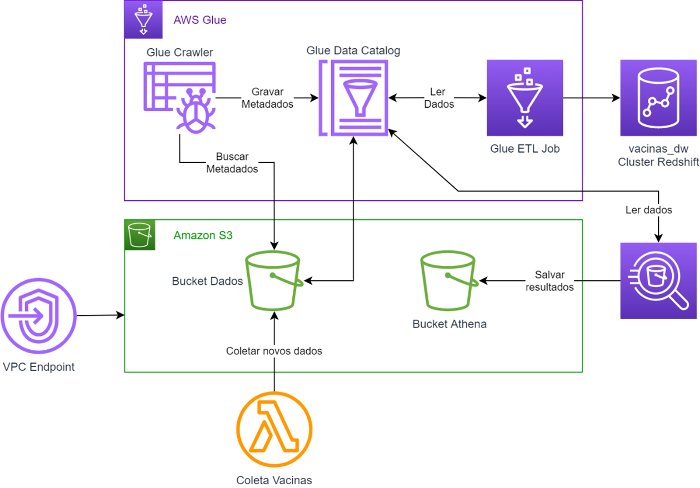


## Configurar um VPC Endpoint para conectar com S3

Para o Crawler do AWS Glue poder ler os dados do S3 é preciso criar um VPC Endpoint, que estabelece uma conexão privada entre a VPC e os serviços da AWS, em passar pela inter-net. Assim, o Glue consegue acessar os dados do S3 de forma privada e segura.

1. Procure na barra superior pelo serviço `VPC` e clique no serviço para abrir

2.	No menu ao lado esquerdo procure e clique em 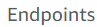

3.	Depois clique em 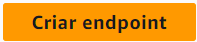

4. No campo `Etiqueta de nome` coloque `s3-glue-endpoint`

5. Na barra de pesquisa da seção `Serviços`  escreva `s3` e aperte `Enter`

6. No resultado selecione a opção que tem seguintes características:
    
    Nome do serviço: `com.amazonaws.us-east-1.s3`    

    Tipo: `Gateway`


    

7. Na seção `VPC` selecione a única opção disponível (`padrão`)


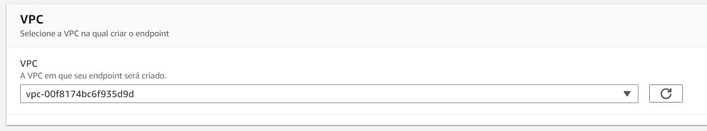


8.	Em  `Tabelas de rotas`  selecione o checkbox da única linha disponível


9.	Clique em 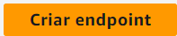

10.	Confirme o endpoint criado


## Criar Crawler no AWS Glue

1.	Procure na barra superior pelo serviço `Glue` e clique no serviço para abrir

2.	No menu lateral esquerdo, procure e clique em  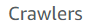

3.	Clique em  e comece a configuração do novo Crawler

    3.1. `Name`: `crawler-vacinas`

    3.2. Clique em 

    3.3.  Na tela seguinte, clique em 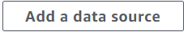. No popup, configure a nova conexão:

    3.4. No popup, selecione o bucket e pasta `dataops-impacta-dados-nomesobrenome/input` (bucket criado no [Laboratório 1](https://github.com/fesousa/dataops-lab1)), clicando em 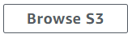. Ao escolher o bucket e a pasta, clique em 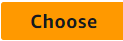


    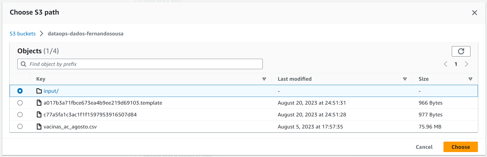

    3.5. Ao voltar para a tela anterior, clique em  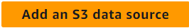

    3.6. Clique em  

    3.7. Em `IAM Role` selecione `Lab Role`

    3.8. Clique em  


    3.9. Na tela `Set output and scheduling`, clique em . Uma nova aba será aberta.
    
    3.10 Na nova aba coloque no campo `Name` o nome `vacinas_database` e clique em  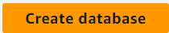 

    3.11. Volte para a aba onde está criando o crawler e clique em  para atualizar as opções de `Target database`

    3.12. Em `Target database` selecione o database que acabou de criar (`vacinas_database`)
    
    3.13. No campo `Table name prefix`  escreva `vacinas_`

    3.14. Clique em 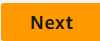 

    3.15. Revise as configurações e clique em 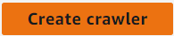 

    3.16. Verifique o Crawler criado na nova tela

    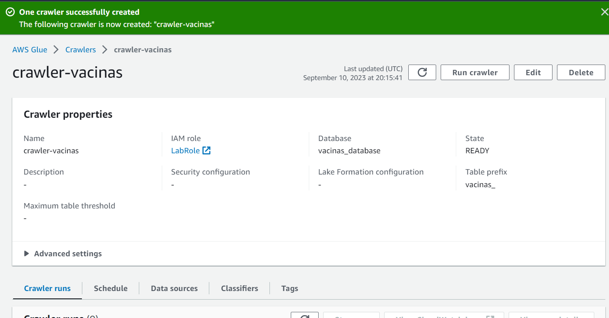


    3.17. Ainda nessa tela, execute o crawler clicando em  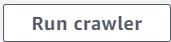. A execuceção começará e poderá ser acompanhada no final da página, na seção `Crawler runs`

    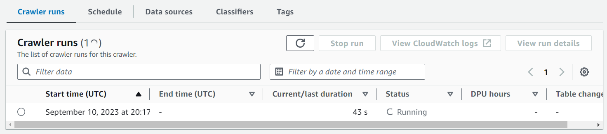
   
    3.18. Aguarde até que o Status fique `Completed` 

     

    3.19 Verifique a nova tabela criada clicando em `Tables` (`Data Catalog --> Database --> Tables`)

    


## Consultar dados do Data Catalog com Amazon Athena

1.	O Amazon Athena precisa de um bucket para armazenar os resultados de consulta. Procure pelo serviço S3 e crie um novo bucket chamado `dataops-impacta-athena-nomesobrenome`. Troque `nomesobrenome` pelo seu nome e sobrenome

2.	Volte ao AWS Glue e selecione `Tables` no menu lateral esquerdo 

3.	Na tela das tabelas, abra a tabela `vacinas_input`

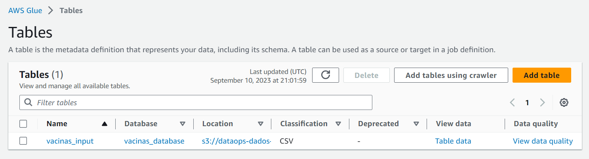
 
4.	Clique em 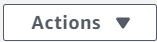 e depois em  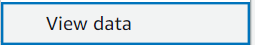


5.	No popup, clique em  para ser redirecionado para o Amazon Athena

6.	Já no Amazon Athena, clique em `Settings`  nas abas superiores

7.	Na seção `Query result and encryption settings`  clique em 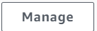

8.	Clique em 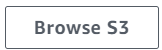 para selecionar o bucket S3 dos resultado

9.	Selecione o bucket `dataops-impacta-athena-nomesobrenome` (bucket que acabou de criar) e clique em 

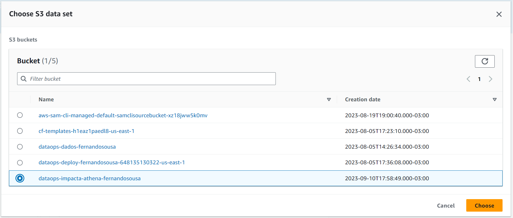


10.	Clique em 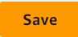

11.	De volta do Athena clique em `Editor`

12. Na seção `Data` ao lado esquerdo, verifique se em `Database` o baco de dados `vacinas_database` está selecionado

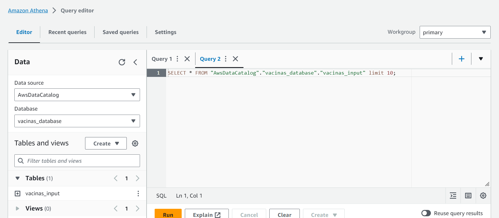
 
13.	Ao lado direito, no editor de consultas, verifique se já existe a seguinte consulta, para re-tornar os 10 primeiros registros:

```sql
SELECT * FROM "vacinas-database"."vacinas_input" limit 10;
```

Se não houver, coloque essa consulta no editor e clique em . Você deverá ver um resultado parecido com o seguinte:

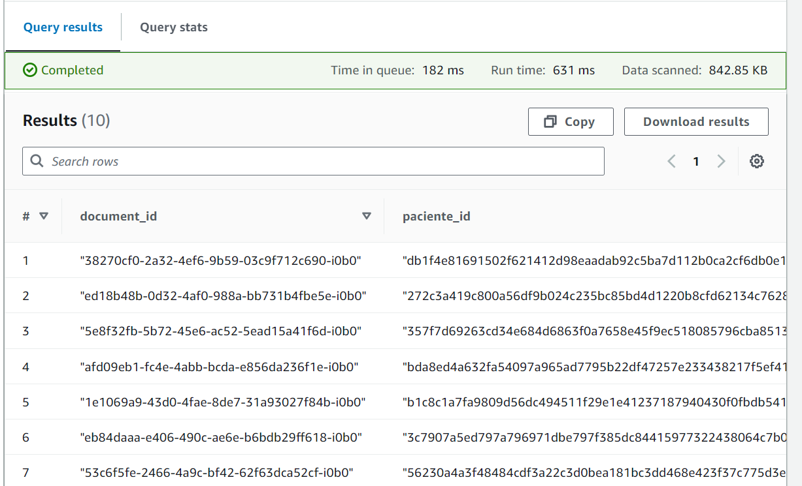

14.	Execute uma nova consulta para retornar a quantidade de registros e veja o resultado

```sql
SELECT count(1) FROM "vacinas-database"."vacinas_input";
```

## Inserir mais dados do Data Catalog

1.	Na AWS, procure e abra o serviço `Lambda`

2.	Selecione a função lambda `dataops-coleta-vacinas-ci-cd` criada no [Laboratório 4](https://github.com/fesousa/dataops-lab4)

3.	Teste a função com o seguinte json

 OBS: O Link abaixo é dinâmico. Pegue outro link de arquivo de vacinação aqui: https://opendatasus.saude.gov.br/dataset/covid-19-vacinacao/resource/5093679f-12c3-4d6b-b7bd-07694de54173

```json
{
    "url":"https://s3.sa-east-1.amazonaws.com/ckan.saude.gov.br/SIPNI/COVID/uf/uf%3DAP/part-00000-0e081da1-2126-45b3-8bfd-78667a8589af.c000.csv", 
    "uf":"ap"
}
```


A execução vai coletar dados de vacinação do Amapá e salvar no S3. Se precisar, veja no [Laboratório 4](https://github.com/fesousa/dataops-lab4) como testar a função lambda

4.	Volte para o Amazon Athena e execute a consulta para contar a quantidade de registros novamente e verifique o resultado. Os dados do Amapá foram inseridos.

5.	Ainda no Athena, execute uma consulta para contar quantos registros existem de cada Estado (campo `estabelecimento_uf`)


## Executar ETL com Glue Job (Trabalho)

1.	Na AWS, procure e abra o serviço `Glue`

2.	No menu da lateral esquerda, selecione 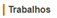

3.	Clique em  

4.	Na tela 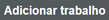 , configure:

    4.1. Nome: `etl-vacinas`
    
    4.2. Função do IAM: `LabRole`

    4.3. Este trabalho executa: selecione a opção `Um script proposto gerado pelo AWS Glue`

    4.4. Clique em  

    4.5. Na tela 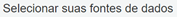 selecione a opção do Data Catalog criado anteriormente (`vacinas-database`)

    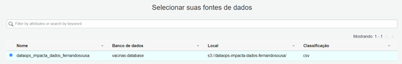
 
    4.6.	Clique em 

    4.7. Na tela seguinte, clique novamente em 

    4.8. Na tela 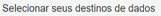 selecione a opção 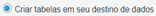

    4.9. Clique em  

    4.10. No popup de configuração da conexão coloque:

&nbsp;&nbsp;&nbsp;&nbsp;&nbsp;&nbsp;&nbsp;&nbsp;&nbsp;&nbsp;&nbsp;&nbsp;a. Nome: `redshift-connection´

&nbsp;&nbsp;&nbsp;&nbsp;&nbsp;&nbsp;&nbsp;&nbsp;&nbsp;&nbsp;&nbsp;&nbsp;b. Tipo de conexão: `Amazon Redshift`

&nbsp;&nbsp;&nbsp;&nbsp;&nbsp;&nbsp;&nbsp;&nbsp;&nbsp;&nbsp;&nbsp;&nbsp;c. Cluster: selecione o cluster criado no [Laboratório 5](https://github.com/fesousa/dataops-lab5)

&nbsp;&nbsp;&nbsp;&nbsp;&nbsp;&nbsp;&nbsp;&nbsp;&nbsp;&nbsp;&nbsp;&nbsp;d. Nome do banco de dados: `dev`

&nbsp;&nbsp;&nbsp;&nbsp;&nbsp;&nbsp;&nbsp;&nbsp;&nbsp;&nbsp;&nbsp;&nbsp;e. Nome de usuário: `awsuser`

&nbsp;&nbsp;&nbsp;&nbsp;&nbsp;&nbsp;&nbsp;&nbsp;&nbsp;&nbsp;&nbsp;&nbsp;f. Senha: coloque a senha criada para o Redshift do [Laboratório 5](https://github.com/fesousa/dataops-lab5)

&nbsp;&nbsp;&nbsp;&nbsp;&nbsp;&nbsp;&nbsp;&nbsp;&nbsp;&nbsp;&nbsp;&nbsp;g. Clique em 

&nbsp;&nbsp;&nbsp;&nbsp;&nbsp;&nbsp;&nbsp;&nbsp;4.11. Retornando a tela de destino dos dados, complete o campo `Nome do banco de dados` com `dev`

&nbsp;&nbsp;&nbsp;&nbsp;&nbsp;&nbsp;&nbsp;&nbsp;4.12. Clique em 

&nbsp;&nbsp;&nbsp;&nbsp;&nbsp;&nbsp;&nbsp;&nbsp;4.13. Na tela seguinte, clique em 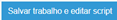

5.	A tela para editar o script será aberta
6.	Coloque o script `pyspark abaixo`

https://github.com/fesousa/dataops-lab6/blob/2738353683fb94c7f69c79c46396e445f77937d2/etl_vacinas.py#L1-L56

7.	Depois de atualizado o script, clique em 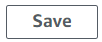 na parte superior

8.	Execute o processo de ELT clicando em  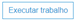

9.	Acompanhe a execução do script:
    
    9.1. Feche o editor de script clicando em  no canto superior direito

    9.2. Confira se está na tela dos trabalhos do Glue, clicando em 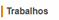 no menu lateral esquerdo

    9.3. Selecione o trabalho `etl-vacinas` criado neste laboratório

    9.4. Veja as execuções na parte inferior

    9.5. Espere até que a execução fique com o status `Succeeded`. A execução demora cerca de 4 minutos. Clique em  do painel inferior de tempos em tempos para ver a atualização


    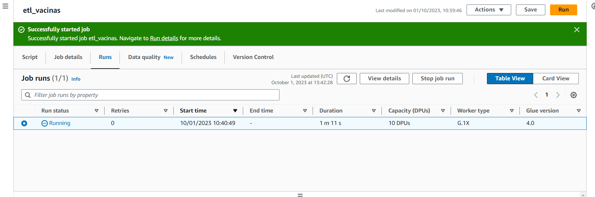

    9.6. Se precisar executar novamente, com o trabalho selecionado clique em  e depois em 

    9.7. Se precisar editar o script, clique em   e depois em 

 
## Verificar tabela no Redshift e Executar Consultas

1.	Na AWS, procure e abra o serviço `Redshift`

2.	No menu lateral esquerdo clique em  e depois em  para abrir os clusters do Redshift

3. Inicie o cluster caso ele estiver parado

    3.1. Selecione o cluster criado no [Laboratório 5](https://github.com/fesousa/dataops-lab5) clicando no checkbox

    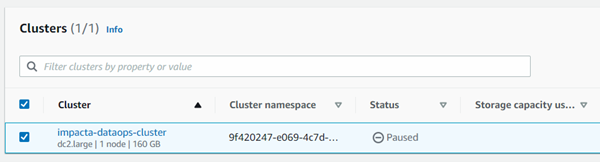
 
    3.2. Clique em  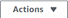 e depois em 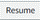

    3.3. Na próxima tela clique em  

    3.4. Espere até que a coluna `Status` do cluster mostre 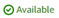

4.	Depois que o cluster estiver executando, no menu lateral esquerdo clique em  e depois em 

5.	Clique em 

6.	Configure a conexão como na imagem abaixo:

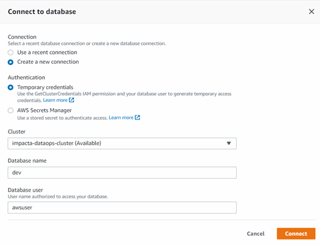
 
7.	Clique em 

8.	Na seção 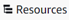  verifique a configuração de conexão:

    8.1. 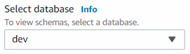


    8.2. 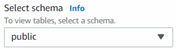


    8.3. Você deve ver a tabela 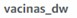   no final de 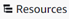

9.	Utilize o editor de consultas para consultar os registros da tabela utilizando SQL

    9.1. Quantidade de registros na tabela

```sql
select count(1) from vacinas_dw;
```

&nbsp;&nbsp;&nbsp;&nbsp;&nbsp;&nbsp;&nbsp;&nbsp;9.2. Quantidade de vacinas por UF

```sql
select sum(quantidade), uf from vacinas_dw group by uf;
```

&nbsp;&nbsp;&nbsp;&nbsp;&nbsp;&nbsp;&nbsp;&nbsp;9.3. Registros de vacinação com mais de 1000 vacinas

```sql
select * from vacinas_dw where quantidade > 1000
```


10. Lembre-se de pausar o cluster Redshift quando terminar o laboratório.

<div class="footer">
    &copy; 2022 Fernando Sousa
    <br/>
    
Last update: 2023-09-10 21:17:34
</div>