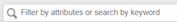
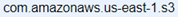
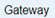
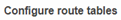
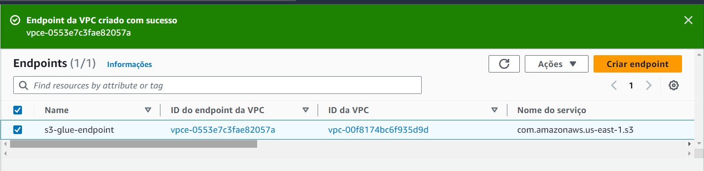
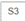

# DataOps - Laboratório 6

Processmento e Análise de Dados em AWS GLue

As instruções do laboratório estão em português. Para alterar o idioma, procure a opção na barra inferior do console AWS.

## Objetivos

* Utilizar AWS Glue Crawler para encontrar dados no S3
* Armazenar dados encontrados pelo Crawler no AWS Glue Data Catalog
* Executar um processo de ETL no AWS Glue para extrair do Data Catalog, fazer transformações, e incluir no Redshift

## Arquitetura da solução

## Configurar um VPC Endpoint para conectar com S3

Para o Crawler do AWS Glue poder ler os dados do S3 é preciso criar um VPC Endpoint, que estabelece uma conexão privada entre a VPC e os serviços da AWS, em passar pela inter-net. Assim, o Glue consegue acessar os dados do S3 de forma privada e segura.

1. Procure na barra superior pelo serviço `VPC` e clique no serviço para abrir

2.	No menu ao lado esquerdo procure e clique em 

3.	Depois clique em 

4.	No campo  escreva `s3` e aperte `Enter`

5.	No resultado selecione a opção que tem seguintes características:
    
    Service Name:      

    Type:  

    

6.	Em    selecione o checkbox da `Route Table` disponível

7.	Clique em 

8.	Na nova tela, clique em 

9.	Confirme o endpoint criado

## Criar Crawler no AWS Glue

1.	Procure na barra superior pelo serviço `Glue` e clique no serviço para abrir

2.	No menu lateral esquerdo, procure e clique em  

3.	Clique em  e comece a configuração do novo Crawler

    3.1. Nome do Crawler: `crawler-vacinas`

    3.2. Clique em 

    3.3. Na tela seguinte, clique em  novamente 

    3.4. Na tela seguinte, configure o datastore

    3.5. No campo   selecione 

    3.6. Clique em . No popup, configure a nova conexão:

&nbsp;&nbsp;&nbsp;&nbsp;&nbsp;&nbsp;&nbsp;a. Nome: `s3-connection`

&nbsp;&nbsp;&nbsp;&nbsp;&nbsp;&nbsp;&nbsp;b. VPC: selecione a única opção disponível

&nbsp;&nbsp;&nbsp;&nbsp;&nbsp;&nbsp;&nbsp;c. Subrede: selecione a primeira

&nbsp;&nbsp;&nbsp;&nbsp;&nbsp;&nbsp;&nbsp;d. Grupo de segurança: selecione `default`

&nbsp;&nbsp;&nbsp;&nbsp;&nbsp;&nbsp;&nbsp;e. Clique em  

    3.7. Em conexão, selecione a conexão recém criada (`s3-connection`)

    3.8. Em `Incluir caminho`, clique em  para selecionar o bucket

    3.9. No popup, selecione o bucket e pasta `dataops-impacta-dados-nomesobrenome/input` (bucket criado no [Laboratório 1](https://github.com/fesousa/dataops-lab1))

&nbsp;&nbsp;&nbsp;&nbsp;&nbsp;&nbsp;&nbsp;

    &copy; 2022 Fernando Sousa
     
    
Last update: 2022-04-03 15:04:04

